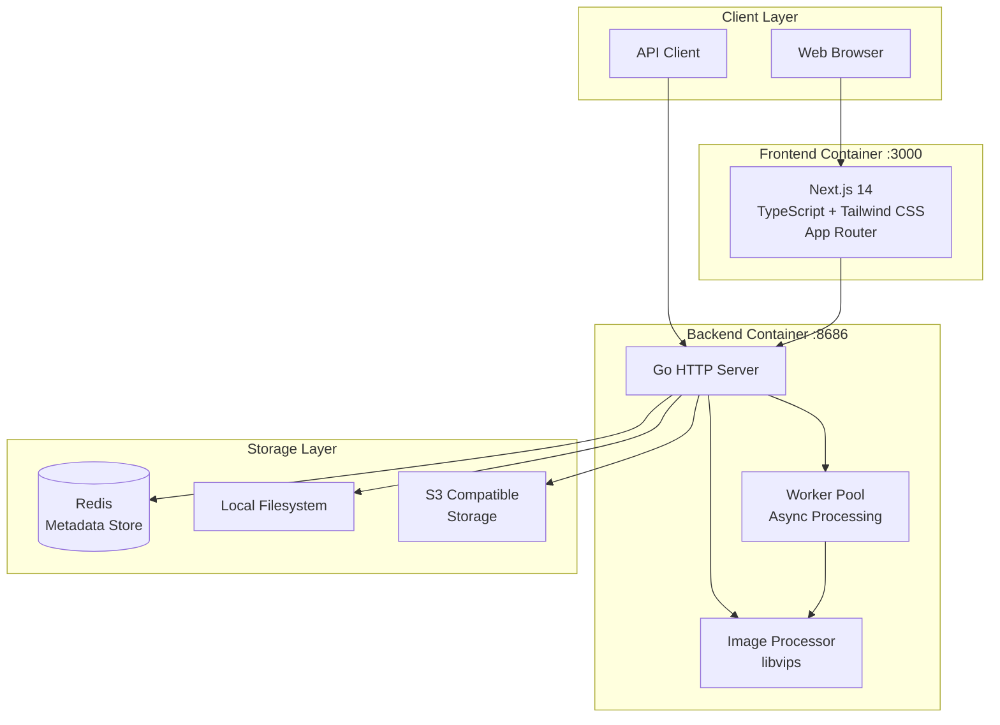

# ImageFlow

<div align="center">

[](https://hub.docker.com/r/soyorins/imageflow-backend)
[](LICENSE)
[](https://go.dev/)
[](https://nextjs.org/)

**A modern image management and distribution platform with automatic format optimization**

[English](README.md) | [中文文档](README_CN.md)

</div>

---

## Introduction

ImageFlow is a full-stack image management platform that automatically optimizes images for different devices and browsers. It combines a high-performance Go backend with a modern Next.js frontend to provide intelligent image conversion, device-aware serving, and powerful filtering capabilities.

## Architecture



### Component Overview

| Component | Technology | Description |
|-----------|------------|-------------|
| Frontend | Next.js 14, TypeScript, Tailwind CSS | Modern web interface with drag-and-drop upload |
| Backend | Go 1.23+, libvips | High-performance image processing server |
| Metadata | Redis | Fast metadata storage with tag indexing |
| Storage | Local / S3 | Flexible storage backend options |

## Features

### Image Processing

- Automatic conversion to WebP and AVIF formats
- High-performance processing powered by libvips
- Configurable quality and compression settings
- Background worker pool for async processing
- GIF preservation (maintains animation)

### Intelligent Distribution

- Device-aware orientation detection (portrait for mobile, landscape for desktop)
- Browser-based format negotiation (AVIF > WebP > Original)
- Multi-tag filtering with AND logic
- Exclusion filters for sensitive content
- Forced orientation override option

### Storage Options

- Local filesystem storage
- S3-compatible object storage (AWS S3, MinIO, Cloudflare R2, etc.)
- Organized directory structure by orientation and format

### Security

- API key authentication for management endpoints
- Automatic cleanup of expired images
- Configurable CORS policies
- Sensitive content auto-exclusion from public APIs

### Modern Frontend

- Next.js 14 with App Router
- Drag-and-drop batch upload
- Dark mode support
- Responsive masonry layout
- Real-time upload progress

## Deployment

### Prerequisites

- Docker and Docker Compose installed
- Minimum 1GB RAM recommended
- Sufficient disk space for image storage

### Quick Start

```bash
# Clone the repository
git clone https://github.com/Yuri-NagaSaki/ImageFlow.git
cd ImageFlow

# Create configuration file
cp .env.example .env

# Edit configuration (see Configuration section below)
nano .env

# Start all services
docker-compose -f docker-compose-separate.yaml up -d
```

After deployment:
- Frontend: `http://localhost:3000`
- Backend API: `http://localhost:8686`

### Service Architecture

The deployment includes three containers:

| Service | Port | Description |
|---------|------|-------------|
| imageflow-frontend | 3000 | Next.js web interface |
| imageflow-backend | 8686 | Go API server |
| imageflow-redis | 6379 | Metadata storage |

## Configuration

Create a `.env` file in the project root with the following settings:

### Core Settings

| Variable | Required | Default | Description |
|----------|----------|---------|-------------|
| `API_KEY` | Yes | - | Authentication key for upload/management APIs |
| `STORAGE_TYPE` | No | `local` | Storage backend: `local` or `s3` |
| `LOCAL_STORAGE_PATH` | No | `static/images` | Path for local image storage |
| `DEBUG_MODE` | No | `false` | Enable debug logging |

### Redis Configuration

| Variable | Required | Default | Description |
|----------|----------|---------|-------------|
| `METADATA_STORE_TYPE` | No | `redis` | Metadata storage type |
| `REDIS_HOST` | No | `localhost` | Redis server hostname |
| `REDIS_PORT` | No | `6379` | Redis server port |
| `REDIS_PASSWORD` | No | - | Redis authentication password |
| `REDIS_DB` | No | `0` | Redis database number |
| `REDIS_TLS_ENABLED` | No | `false` | Enable TLS for Redis connection |

### S3 Configuration (when STORAGE_TYPE=s3)

| Variable | Required | Default | Description |
|----------|----------|---------|-------------|
| `S3_ENDPOINT` | Yes | - | S3 endpoint URL |
| `S3_REGION` | Yes | - | S3 region |
| `S3_ACCESS_KEY` | Yes | - | S3 access key |
| `S3_SECRET_KEY` | Yes | - | S3 secret key |
| `S3_BUCKET` | Yes | - | S3 bucket name |
| `CUSTOM_DOMAIN` | No | - | Custom domain for S3 assets |

### Image Processing

| Variable | Required | Default | Description |
|----------|----------|---------|-------------|
| `MAX_UPLOAD_COUNT` | No | `20` | Maximum images per upload request |
| `IMAGE_QUALITY` | No | `80` | Conversion quality (1-100) |
| `WORKER_THREADS` | No | `4` | libvips parallel processing threads |
| `WORKER_POOL_SIZE` | No | `4` | Concurrent image processing workers |
| `SPEED` | No | `5` | Encoding speed (0=slowest/best, 8=fastest) |

### Frontend Configuration

| Variable | Required | Default | Description |
|----------|----------|---------|-------------|
| `NEXT_PUBLIC_API_URL` | No | - | Backend API URL for frontend |
| `NEXT_PUBLIC_REMOTE_PATTERNS` | No | - | Allowed image domains (comma-separated) |

### Example Configuration

```bash
# Core
API_KEY=your-secure-api-key-here
STORAGE_TYPE=local
DEBUG_MODE=false

# Redis
METADATA_STORE_TYPE=redis
REDIS_HOST=redis
REDIS_PORT=6379

# Image Processing
IMAGE_QUALITY=80
WORKER_THREADS=4
WORKER_POOL_SIZE=4
MAX_UPLOAD_COUNT=20

# Frontend 
NEXT_PUBLIC_API_URL=http://backend:8686
NEXT_PUBLIC_REMOTE_PATTERNS=http://backend:8686,https://s3.url
```

## API Reference

### Public Endpoints

#### Get Random Image

```http
GET /api/random
```

Query Parameters:

| Parameter | Type | Description |
|-----------|------|-------------|
| `tag` | string | Filter by single tag |
| `tags` | string | Filter by multiple tags (comma-separated, AND logic) |
| `exclude` | string | Exclude images with these tags (comma-separated) |
| `orientation` | string | Force orientation: `portrait` or `landscape` |
| `format` | string | Preferred format: `avif`, `webp`, or `original` |

Examples:

```bash
# Basic random image
curl "http://localhost:8686/api/random"

# Filter by tags
curl "http://localhost:8686/api/random?tags=nature,landscape"

# Exclude sensitive content
curl "http://localhost:8686/api/random?tag=wallpaper&exclude=nsfw,private"

# Force portrait orientation
curl "http://localhost:8686/api/random?orientation=portrait&format=webp"
```

### Authenticated Endpoints

All management endpoints require the `Authorization` header:

```
Authorization: Bearer your-api-key
```

#### Upload Images

```http
POST /api/upload
Content-Type: multipart/form-data
```

| Field | Type | Description |
|-------|------|-------------|
| `images[]` | file | Image files to upload (multiple allowed) |
| `tags` | string | Comma-separated tags |
| `expiryMinutes` | number | Auto-delete after N minutes (optional) |

#### List Images

```http
GET /api/images
```

| Parameter | Type | Description |
|-----------|------|-------------|
| `page` | number | Page number |
| `tag` | string | Filter by tag |
| `orientation` | string | Filter by orientation |

#### Delete Image

```http
POST /api/delete-image
Content-Type: application/json

{"id": "image-uuid"}
```

#### Get All Tags

```http
GET /api/tags
```

#### Get Configuration

```http
GET /api/config
```

## Project Structure

```
ImageFlow/
├── main.go                 # Application entry point
├── config/                 # Configuration management
├── handlers/               # HTTP request handlers
│   ├── auth.go            # Authentication middleware
│   ├── upload.go          # Image upload handler
│   ├── random.go          # Random image API
│   ├── list.go            # Image listing
│   ├── delete.go          # Image deletion
│   └── tags.go            # Tag management
├── utils/                  # Core utilities
│   ├── converter_bimg.go  # libvips image processing
│   ├── storage.go         # Storage interface
│   ├── redis.go           # Redis operations
│   ├── worker_pool.go     # Async processing
│   └── cleaner.go         # Expired image cleanup
├── frontend/              # Next.js application
│   ├── app/               # App Router pages
│   ├── components/        # React components
│   └── utils/             # Frontend utilities
├── docker-compose-separate.yaml  # Docker deployment (frontend + backend)
├── Dockerfile             # Backend container
├── Dockerfile.frontend    # Frontend container
└── .env.example           # Configuration template
```

## Image Storage Structure

```
static/images/
├── original/
│   ├── landscape/         # Original landscape images
│   └── portrait/          # Original portrait images
├── landscape/
│   ├── webp/              # WebP converted landscape
│   └── avif/              # AVIF converted landscape
├── portrait/
│   ├── webp/              # WebP converted portrait
│   └── avif/              # AVIF converted portrait
└── gif/                   # GIF files (preserved)
```

## License

This project is licensed under the MIT License. See the [LICENSE](LICENSE) file for details.

## Acknowledgments

- [libvips](https://github.com/libvips/libvips) - High-performance image processing library
- [bimg](https://github.com/h2non/bimg) - Go bindings for libvips
- [Next.js](https://nextjs.org/) - React framework for production
- [Tailwind CSS](https://tailwindcss.com/) - Utility-first CSS framework
- [Redis](https://redis.io/) - In-memory data store

## Support

- [Documentation](API_USAGE_GUIDE.md)
- [Report Issues](https://github.com/Yuri-NagaSaki/ImageFlow/issues)
- [Discussions](https://github.com/Yuri-NagaSaki/ImageFlow/discussions)
