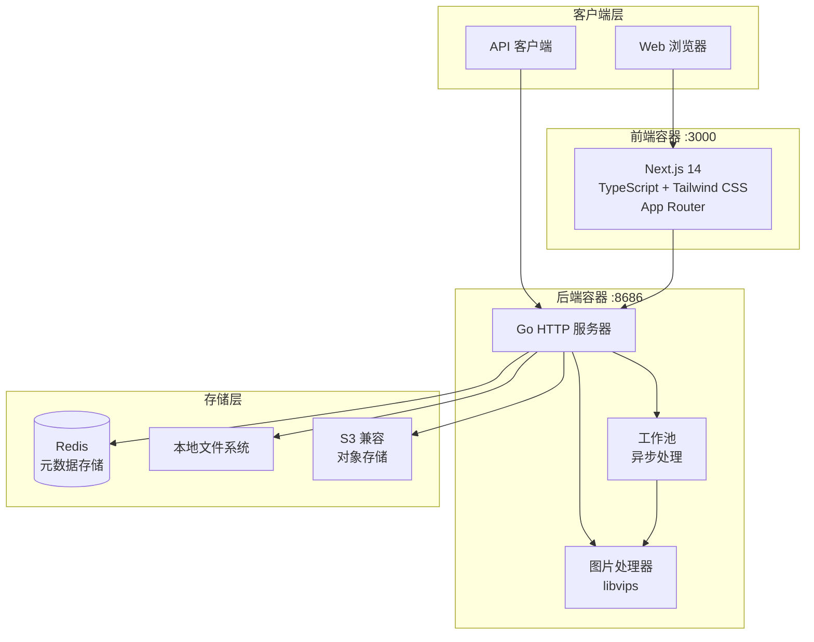

<div align="center">

# ImageFlow


[](https://hub.docker.com/r/soyorins/imageflow-backend)
[](LICENSE)
[](https://go.dev/)
[](https://nextjs.org/)
[](https://deepwiki.com/Yuri-NagaSaki/ImageFlow)

**现代化图片管理与分发平台，支持自动格式优化**

[English](README.md) | [中文文档](README_CN.md)

</div>

---

## 简介

ImageFlow 是一个全栈图片管理平台，能够自动为不同设备和浏览器优化图片。它结合了高性能的 Go 后端和现代化的 Next.js 前端，提供智能图片转换、设备感知服务和强大的过滤功能。

## 预览

<div align="center">


</div>

## 系统架构



### 组件概览

| 组件 | 技术栈 | 描述 |
|------|--------|------|
| 前端 | Next.js 14, TypeScript, Tailwind CSS | 现代化 Web 界面，支持拖拽上传 |
| 后端 | Go 1.23+, libvips | 高性能图片处理服务器 |
| 元数据 | Redis | 快速元数据存储，支持标签索引 |
| 存储 | Local / S3 | 灵活的存储后端选项 |

## 功能特性

### 图片处理

- 自动转换为 WebP 和 AVIF 格式
- 基于 libvips 的高性能处理
- 可配置的质量和压缩设置
- 后台工作池异步处理
- GIF 保持原格式（保留动画）

### 智能分发

- 设备感知方向检测（移动端竖屏，桌面端横屏）
- 基于浏览器的格式协商（AVIF > WebP > 原格式）
- 多标签过滤，支持 AND 逻辑
- 敏感内容排除过滤
- 强制方向覆盖选项

### 存储选项

- 本地文件系统存储
- S3 兼容对象存储（AWS S3、MinIO、Cloudflare R2 等）
- 按方向和格式组织的目录结构

### 安全特性

- 管理端点 API Key 认证
- 过期图片自动清理
- 可配置的 CORS 策略
- 公共 API 自动排除敏感内容

### 现代化前端

- Next.js 14 App Router
- 拖拽批量上传
- 深色模式支持
- 响应式瀑布流布局
- 实时上传进度

## 部署指南

### 环境要求

- 已安装 Docker 和 Docker Compose
- 建议最低 1GB 内存
- 足够的磁盘空间用于图片存储

### 快速开始

```bash
# 克隆仓库
git clone https://github.com/Yuri-NagaSaki/ImageFlow.git
cd ImageFlow

# 创建配置文件
cp .env.example .env

# 编辑配置（参见下方配置说明）
nano .env

# 启动所有服务（使用预构建镜像）
docker-compose up -d

# 或本地构建用于开发/测试
docker-compose -f docker-compose.build.yaml up --build -d
```

部署完成后：
- 前端界面：`http://localhost:3000`
- 后端 API：`http://localhost:8686`

### 服务架构

部署包含三个容器：

| 服务 | 端口 | 描述 |
|------|------|------|
| imageflow-frontend | 3000 | Next.js Web 界面 |
| imageflow-backend | 8686 | Go API 服务器 |
| imageflow-redis | 6379 | 元数据存储 |

## 配置说明

在项目根目录创建 `.env` 文件，包含以下设置：

### 核心配置

| 变量 | 必需 | 默认值 | 描述 |
|------|------|--------|------|
| `API_KEY` | 是 | - | 上传/管理 API 的认证密钥 |
| `STORAGE_TYPE` | 否 | `local` | 存储后端：`local` 或 `s3` |
| `LOCAL_STORAGE_PATH` | 否 | `static/images` | 本地图片存储路径 |
| `DEBUG_MODE` | 否 | `false` | 启用调试日志 |

### Redis 配置

| 变量 | 必需 | 默认值 | 描述 |
|------|------|--------|------|
| `METADATA_STORE_TYPE` | 否 | `redis` | 元数据存储类型 |
| `REDIS_HOST` | 否 | `localhost` | Redis 服务器主机名 |
| `REDIS_PORT` | 否 | `6379` | Redis 服务器端口 |
| `REDIS_PASSWORD` | 否 | - | Redis 认证密码 |
| `REDIS_DB` | 否 | `0` | Redis 数据库编号 |
| `REDIS_TLS_ENABLED` | 否 | `false` | 启用 Redis TLS 连接 |

### S3 配置（当 STORAGE_TYPE=s3 时）

| 变量 | 必需 | 默认值 | 描述 |
|------|------|--------|------|
| `S3_ENDPOINT` | 是 | - | S3 端点 URL |
| `S3_REGION` | 是 | - | S3 区域 |
| `S3_ACCESS_KEY` | 是 | - | S3 访问密钥 |
| `S3_SECRET_KEY` | 是 | - | S3 秘密密钥 |
| `S3_BUCKET` | 是 | - | S3 存储桶名称 |
| `CUSTOM_DOMAIN` | 否 | - | S3 资源自定义域名 |

### 图片处理配置

| 变量 | 必需 | 默认值 | 描述 |
|------|------|--------|------|
| `MAX_UPLOAD_COUNT` | 否 | `20` | 单次上传最大图片数 |
| `IMAGE_QUALITY` | 否 | `80` | 转换质量（1-100） |
| `WORKER_THREADS` | 否 | `4` | libvips 并行处理线程数 |
| `WORKER_POOL_SIZE` | 否 | `4` | 并发图片处理工作数 |
| `SPEED` | 否 | `5` | 编码速度（0=最慢/最佳，8=最快） |

### 前端配置

| 变量 | 必需 | 默认值 | 描述 |
|------|------|--------|------|
| `NEXT_PUBLIC_API_URL` | 否 | - | 前端使用的后端 API URL |
| `NEXT_PUBLIC_REMOTE_PATTERNS` | 否 | - | 允许的图片域名（逗号分隔） |

### 配置示例

```bash
# 核心配置
API_KEY=your-secure-api-key-here
STORAGE_TYPE=local
DEBUG_MODE=false

# Redis 配置
METADATA_STORE_TYPE=redis
REDIS_HOST=redis
REDIS_PORT=6379

# 图片处理
IMAGE_QUALITY=80
WORKER_THREADS=4
WORKER_POOL_SIZE=4
MAX_UPLOAD_COUNT=20

# 前端配置
NEXT_PUBLIC_API_URL=http://backend:8686
NEXT_PUBLIC_REMOTE_PATTERNS=http://backend:8686,https://s3.url
```

## API 参考

### 公开端点

#### 获取随机图片

```http
GET /api/random
```

查询参数：

| 参数 | 类型 | 描述 |
|------|------|------|
| `tag` | string | 按单个标签过滤 |
| `tags` | string | 按多个标签过滤（逗号分隔，AND 逻辑） |
| `exclude` | string | 排除包含这些标签的图片（逗号分隔） |
| `orientation` | string | 强制方向：`portrait` 或 `landscape` |
| `format` | string | 首选格式：`avif`、`webp` 或 `original` |

示例：

```bash
# 基础随机图片
curl "http://localhost:8686/api/random"

# 按标签过滤
curl "http://localhost:8686/api/random?tags=nature,landscape"

# 排除敏感内容
curl "http://localhost:8686/api/random?tag=wallpaper&exclude=nsfw,private"

# 强制竖屏方向
curl "http://localhost:8686/api/random?orientation=portrait&format=webp"
```

### 认证端点

所有管理端点需要 `Authorization` 请求头：

```
Authorization: Bearer your-api-key
```

#### 上传图片

```http
POST /api/upload
Content-Type: multipart/form-data
```

| 字段 | 类型 | 描述 |
|------|------|------|
| `images[]` | file | 要上传的图片文件（支持多个） |
| `tags` | string | 逗号分隔的标签 |
| `expiryMinutes` | number | N 分钟后自动删除（可选） |

#### 列出图片

```http
GET /api/images
```

| 参数 | 类型 | 描述 |
|------|------|------|
| `page` | number | 页码 |
| `tag` | string | 按标签过滤 |
| `orientation` | string | 按方向过滤 |

#### 删除图片

```http
POST /api/delete-image
Content-Type: application/json

{"id": "image-uuid"}
```

#### 获取所有标签

```http
GET /api/tags
```

#### 获取配置

```http
GET /api/config
```

## 项目结构

```
ImageFlow/
├── main.go                 # 应用入口
├── config/                 # 配置管理
├── handlers/               # HTTP 请求处理器
│   ├── auth.go            # 认证中间件
│   ├── upload.go          # 图片上传处理器
│   ├── random.go          # 随机图片 API
│   ├── list.go            # 图片列表
│   ├── delete.go          # 图片删除
│   └── tags.go            # 标签管理
├── utils/                  # 核心工具
│   ├── converter_bimg.go  # libvips 图片处理
│   ├── storage.go         # 存储接口
│   ├── redis.go           # Redis 操作
│   ├── worker_pool.go     # 异步处理
│   └── cleaner.go         # 过期图片清理
├── frontend/              # Next.js 应用
│   ├── app/               # App Router 页面
│   ├── components/        # React 组件
│   └── utils/             # 前端工具
├── docker-compose.yaml       # Docker 部署（预构建镜像）
├── docker-compose.build.yaml # Docker 部署（本地构建）
├── Dockerfile.backend        # 后端容器
├── Dockerfile.frontend       # 前端容器
└── .env.example           # 配置模板
```

## 图片存储结构

```
static/images/
├── original/
│   ├── landscape/         # 原始横屏图片
│   └── portrait/          # 原始竖屏图片
├── landscape/
│   ├── webp/              # WebP 格式横屏
│   └── avif/              # AVIF 格式横屏
├── portrait/
│   ├── webp/              # WebP 格式竖屏
│   └── avif/              # AVIF 格式竖屏
└── gif/                   # GIF 文件（保持原格式）
```

## 许可证

本项目基于 MIT 许可证开源。详见 [LICENSE](LICENSE) 文件。

## 致谢

- [libvips](https://github.com/libvips/libvips) - 高性能图片处理库
- [bimg](https://github.com/h2non/bimg) - libvips 的 Go 绑定
- [Next.js](https://nextjs.org/) - 生产级 React 框架
- [Tailwind CSS](https://tailwindcss.com/) - 实用优先的 CSS 框架
- [Redis](https://redis.io/) - 内存数据存储

## 支持

- [文档](API_USAGE_GUIDE.md)
- [报告问题](https://github.com/Yuri-NagaSaki/ImageFlow/issues)
- [讨论](https://github.com/Yuri-NagaSaki/ImageFlow/discussions)
